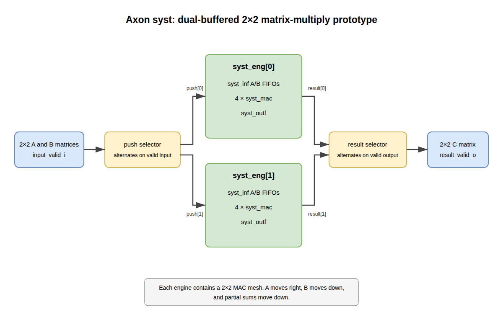

# Syst

## Purpose

`syst` is the current 2×2 unsigned integer matrix-multiply prototype. The
name distinguishes this concrete systolic datapath from the broader future
processing-element architecture, which may eventually contain other compute
units and interfaces.

## Parameters

- `DataWidth` sets the width of each A and B matrix element; the default is 4.
- Results use `(2 * DataWidth) + 1` bits to hold the sum of two unsigned
  products.

## Interfaces

The top accepts scalar elements `a11_i` through `a22_i` and `b11_i` through
`b22_i`. `input_valid_i` submits one pair of 2×2 matrices. Results appear on
`c11_o` through `c22_o` with `result_valid_o`.

There is currently no input-ready or output-ready signal. The caller must obey
the implementation's implicit scheduling and capacity assumptions.

## Clock and reset

All state is clocked by `clk_i`. `rst_ni` is synchronous and active low.

## Microarchitecture

The top alternates accepted inputs between two identical `syst_eng`
instances. It similarly alternates between their result FIFOs. This
double-engine arrangement was intended to sustain traffic while an individual
engine performs its three-state operand schedule.

Each engine contains:

- two custom input FIFOs that accept four elements and expose one or two;
- four `syst_mac` elements arranged as a 2×2 mesh;
- double-buffered B operands selected by a one-bit slot;
- an output FIFO that gathers one or two accumulator results into a four-result
  matrix.

A operands move from the left MAC to the right MAC. B operands move from the
top MAC to the bottom MAC. Partial sums from the top row feed the bottom row.

## Operation and timing

The engine controller sequences `Cycle0`, `Cycle1`, and `Cycle2` and delays the
A-side FIFO controls by two cycles to align them with the B operands. The exact
input-to-result latency and sustainable traffic contract have not yet been
verified and must not be inferred solely from the current state machine.

## Assertions and invariants

The simulation-only bound FIFO monitor checks occupancy, underflow, overflow
and legal operation counts. Valid scheduling, slot alignment and matrix-level
behavior remain unverified while the top-level functional test fails.

## FuseSoC targets

- `default` contains only the reusable synthesizable RTL;
- `lint` runs strict Verilator lint with `syst` as the top;
- `sim` runs the new self-failing matrix test (currently failing);
- `sim_fifo` runs independent FIFO checks with active assertions.

The old randomized testbench is retained as `dv/legacy/syst_legacy_tb.sv` for
behavioral reference only. It prints mismatches rather than failing the
process, drives inputs in the same clock-edge scheduling region as the DUT,
and uses a constraint that Verilator 5.020 ignores. Both the original RTL and
the normalized RTL produce 256 printed mismatches with seed 1 under that
simulator. It is deliberately excluded from FuseSoC targets and from policy
enforcement through an explicit legacy-file annotation.

## Limitations and deferred work

- Functional behavior has not been reverified after the Axon normalization.
- The custom FIFOs do not expose full/empty backpressure and do not protect
  against overflow or underflow.
- The external interface has no ready signal.
- Arithmetic is unsigned.
- The controller assumes a particular stream ordering and internal latency.
- Matrix simulation is executable but failing; no matrix-functional maturity
  or datapath formal proof is claimed.

`block_diag.jpg` is retained as the original historical drawing. The editable
source of the normalized overview is `syst.drawio`.

## Diagnostic example and known limitations

The supported `dv/tb/syst_tb.sv` replaces the legacy bench as executable evidence.
It drives and checks on falling edges, compares against independent unsigned
A×B arithmetic, and fails nonzero on mismatches or missing results. Input-order
completion is the proposed contract awaiting designer confirmation. With two
back-to-back matrices, the first expected result `[19,22,43,50]` instead appeared
as `[32,38,22,16]`. The output selector resets to engine 1 while input submission
starts at engine 0. Arithmetic alignment still needs investigation after the
ordering contract is confirmed. No RTL datapath repair is claimed yet.

The independent `sim_fifo` target checks the input FIFO at Depth=3 and output
FIFO at Depth=2: exact capacity, one/two-element operations, simultaneous
read/write, wraparound, ordering, empty state and reset with pending data.
`--TEST=directed --SEED=1 --CYCLES=2000` passed 2,011 checks. The bound monitor
uses Axon assertion wrappers with `AXON_ASSERTIONS` and `--assert` enabled to
check occupancy, legal counts, underflow and overflow. The diagnostic
`--TEST=negative_underflow` intentionally fails `NoUnderflow_A`; it is excluded
from passing gates. These are simulation assertions, not formal proofs.

The FIFO contract permits reads only from pre-edge occupancy. Simultaneous
writes may consume capacity freed by reads at that edge. Input FIFO pushes four
items and pops zero/one/two; output FIFO pushes zero/one/two and pops four.
Full flags and runtime overflow protection remain absent. These tests establish
local FIFO behavior; they do not establish a safe external top-level schedule.
